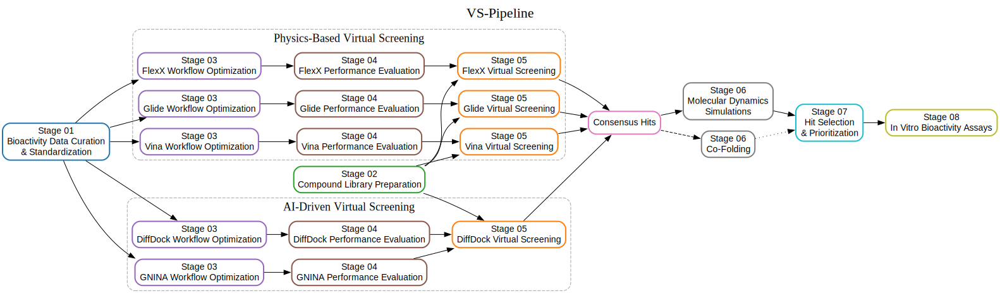

# VS-Pipeline: Virtual Screening Workflow for Lead Compound Discovery

<p align="center"><a href="LICENSE"></a><a href="#"></a><a href="environment/environment.yml"></a><a href="docs/workflow/"></a><a href="CITATION.cff"></a></p>


## Introduction



VS-Pipeline is a modular virtual screening workflow developed to support lead compound discovery in structure-based drug design studies, independent of a specific biological target. The pipeline provides a standardized framework that can be adapted by users to different targets by replacing input structures, datasets, and screening parameters.

The workflow includes the preparation of bioactivity datasets for model development, the standardization of compound libraries for screening, and the independent optimization of physics-based and AI-based virtual screening pipelines. These workflows are executed in parallel to enable direct comparison of screening strategies under identical input conditions.

Following virtual screening, selected ligand–protein complexes are analyzed using co-folding and molecular dynamics simulations as complementary but distinct evaluation steps. Co-folding is employed to compare predicted binding modes across different methods, while molecular dynamics simulations are used to assess the temporal stability of selected complexes. These analyses are performed to support informed compound prioritization rather than to replace screening results.

Application of the pipeline enables the identification of compounds exhibiting nanomolar-range bioactivity, providing a rational basis for the selection and refinement of lead candidates for further investigation.

## Repository Structure

The repository is organized into modular components reflecting the stages of the virtual screening workflow.

- **`pipeline/`**
  
  Core implementation of the virtual screening workflow, organized into sequential stages:
  - **`01_CompoundUniqifier/`** – Compound-level deduplication and standardization.
  - **`02_SARUniqifier/`** – Bioactivity dataset refinement.
  - **`03_Optimization/`** – Physics-based and AI-driven docking workflow optimization.
  - **`04_Validation/`** – Retrospective validation using actives/decoys and ROC analysis.
  - **`05_Virtual_Screening/`** – Large-scale virtual screening pipelines.
  - **`06_Downstream/`** – Post-processing utilities

- **`docs/`**  
  High-level documentation describing the conceptual workflow and individual stages.

- **`environment/`**  
  Conda environment definition and environment validation utilities.

- **`figures/`**  
  Workflow diagrams and figures used in documentation.

- **Top-level files**
  - **`README.md`** – General overview and navigation guide  
  - **`CITATION.cff`** – Citation metadata  
  - **`LICENSE`** – License information

## Installation & Environment Setup

### Clone the repository

```bash
git clone <https://github.com/aolgac/vs-pipeline>
cd vs-pipeline
```

### Create and activate the Conda environment

```bash
conda env create -f environment/environment.yml
conda activate vs-pipeline
```

### Verify the environment

```bash
python environment/check_environment.py
```

The environment check script verifies the availability of required Python
packages and external tools used throughout the pipeline.

## Usage Overview

This repository implements a modular virtual screening workflow. Each pipeline
stage is self-contained and documented within its own directory. The root
README provides a high-level overview only; detailed usage instructions are
available in the corresponding sub-pipeline README.md files.

## License

This project is licensed under the [GNU General Public License v2 (GPL-2.0)](LICENSE).  
See the LICENSE file for full details.

## Citation

If you use VS-Pipeline in your work, please cite:

**Yılmaz, E.Y.** (2025). *Designing a Virtual Screening Workflow for Lead Compound Discovery by Eliciting Binding Modes*.  
Hacettepe University, Graduate School of Health Sciences, Bioinformatics Program, Master's Degree Thesis, Ankara.  

Advisors: Prof. Dr. Tunca Doğan and Asst. Prof. Abdurrahman Olğaç.  

A CITATION file is also provided: [`CITATION.cff`](CITATION.cff)
